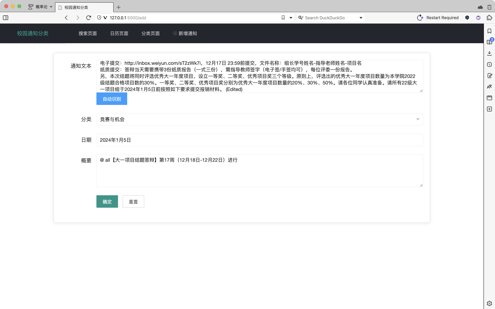
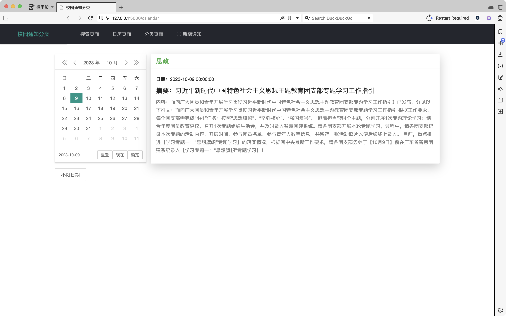
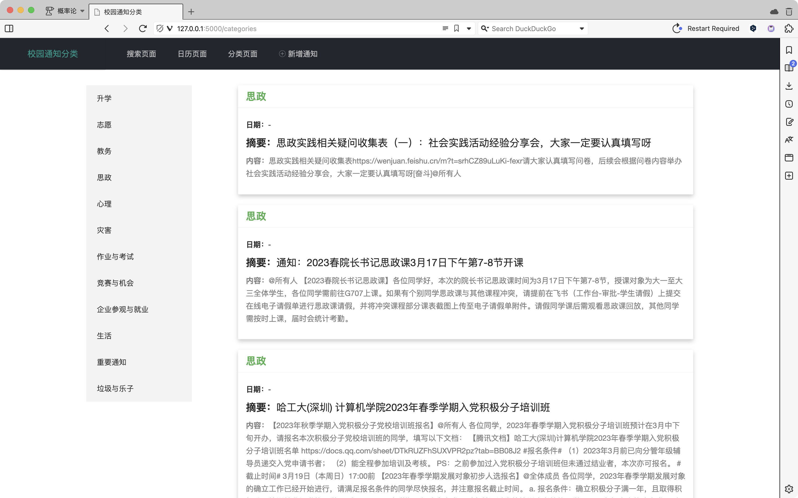

# 结题报告

### 1. 课题背景

随着信息化发展，通知更多借助网络渠道。学校目前使用的飞书 App 仍存在重要通知被淹没、通知对象针对性不强、通知本身信息冗杂等问题。学长学姐开发的 App 不支持自动生成关于截止日期的提醒。大多数同学需要在群消息中反复寻找、查看同一条通知，时间利用效率低。项目计划设计并实现一个通知内容管理 App，实现学校通知精准分类、要点捕捉与简化、重要通知收藏与推荐、日程安排表个性化生成五项功能，希望服务于学院通知发布工作。

### 2. 课题研究内容与方法

#### 研究内容

本项目通过对 “文本挖掘”的研究，利用相关算法将学院以大段文本形式呈现、信息糅合一体的通知抽象成一个个简单标签，可以实现对标签的分类，并且查询到相关的日期。此外，我们还实现了“文本摘要”，可以将大段冗余的通知总结成一段精简的通知

#### 实施方案

（其实我们是先有了后端，再有的前端的，但是报告顺序以及答辩顺序，我们认为可以先展示前端）

##### 第一阶段：基础学习

学习了相关知识：python 的基本用法，学习了基于 pytorch 的模型搭建与调试，学习了 transformers 的调试方法，学习了 “迁移学习” 的 机器学习方法，学习了 css，javascript 语法，学习了 flask 框架、ajax 开发前端，学习了如何使用 SQLAlchemy。学习了 docker 部署等技巧。我们还学习了组员的协作，通过 git 进行版本的管理。

##### 第三阶段：前端开发

前端开发：我们使用了非常简单易用的 LayUI。Layui 是一套免费的开源 Web UI 组件库，我们在 flask 中的 jinja2 模板中调用了 LayUI。我们通过 SQLAlchemy，创建了通知（notice）的 ORM 模型，这能让我们简单且安全的与本地数据库进行交互。

下面是 server，也就是我们这个项目的主体的目录结构：

```sh
(base) ╭─wangfiox@localhost ~/Documents/freshman_project  ‹main*›
╰─➤  tree
.
├── app.py
├── blueprints
│   └── notice.py
├── config.py
├── data_utils.py
├── exts.py
├── models.py
├── model
│   ├── config.json
│   ├── pytorch_model.bin
│   ├── special_tokens_map.json
│   ├── tokenizer_config.json
│   └── vocab.txt
├── statics
│   ├── image（文件夹，jinja2 模板中一些图片）
│   ├── js（文件夹，里面有jQuery，被layui、templates/*依赖）
│   └── layui（文件夹，web ui 组建库）
├── templates
│   ├── add.html
│   ├── base.html
│   ├── calendar.html
│   ├── search.html
│   └── categories.html
├── tokenizers_pegasus.py
```

下面我将对这个目录中的每个文件进行介绍（根据拓扑顺序）：

- templates 文件夹里面存放的就是我们的 jinja2 模板，json 数据传递通过 ajax 实现
  - `base.html`相当于是我们其他 html 的底板，里面是整个网页的主题，可以在其他的 templates html 中看到有``这句话，也可以理解成是继承的关系
  - `add.html`就是添加通知，并且能够与我们的 server 进行交互
  - `calender.html`就是用到了 layUI 的日历组件，日期与对应的 通知
  - `categories.html`就是我们可以看到分类与分类标签的地方（上图！）
  - `search.html`就是搜索页面
- `exts.py`只进行了一个简单的功能，打开数据库
- `config.py`是与数据库交流的必要配置，帐号，密码，端口等。
- `models.py`并不是人工智能的模型，而是与数据库交流的 ORM 模型
- `data_utils.py`是 fengshen 模型库处理数据的辅助文件，被`tokenizer_pegasus.py`依赖。这里直接放到了项目中，一个是环境的问题，还有一个是网络的问题，即使挂了代理，有时候还是莫名奇妙的会说是下载失败（，尽管我环境中确实有 fengshen。（fengshen 是 idea-ccnl 研究院针对中文训练的一系列大模型）。
- `tokenizers_pegasus.py`是 fengshen 模型库的 tokenizers。这个文件被`notice.py`依赖，在文本摘要的时候，用来将输入的文本编码。`pegasus`就是一个专门用来处理文本摘要的模型。
- `static`只是静态文件，简而言之就是：资源包。
- `blueprints/notices.py`这个就是用来处理通知的，里面有文本摘要，模糊搜索，添加通知，文本分类的函数。
- `model`这个文件夹里面就存放着：字典`vocab.txt`，超参数`tokenizer_config.json`，`special_tokens_map.json`，`config.json`，以及训练好的模型。
- `app.py`是`top_module`，能路由网页等，启动网页，依赖`config.py`，`exts.py`，`notice.py`，`templates`







看了上面的介绍，可以看出，我们的最核心的文件是`notice.py`，下面一览`notice.py`的全貌

###### 1. 输入文本，输出标签

```py
def predict_label(text):
    # 对文本进行编码
    inputs = tokenizer_classify(text, return_tensors="pt", truncation=True, padding='max_length', max_length=128)

    # 将输入移到模型所在的设备上
    inputs = {key: val.to(model_classify.device) for key, val in inputs.items()}

    # 使用模型进行预测，这里不会进行训练
    with torch.no_grad():
        outputs = model_classify(**inputs)
        logits = outputs.logits
        predicted_label_id = logits.argmax(-1).item()

    # 获取预测的类别名
    predicted_label = id_to_label[predicted_label_id]

    return predicted_label
```

###### 2. 文本摘要

```py
def summarize_text(text, max_length=128, num_beams=4, length_penalty=2.0, max_length_output=150):
    """
    用输入的模型和分词器生成输入文本的摘要。
    参数：
        - text (str): 要生成摘要的输入文本。
    """

    inputs = tokenizer_summarize(text, max_length=max_length,
                                 truncation=True, return_tensors="pt")

    # beam search 生成摘要
    summary_ids = model_summarize.generate(
        inputs["input_ids"],
        num_beams=num_beams,
        length_penalty=length_penalty,  # 惩罚系数是2.0
        max_length=max_length_output,
        no_repeat_ngram_size=3  # 生成文本时避免重复的n元组的大小
    )

    return tokenizer_summarize.batch_decode(summary_ids, skip_special_tokens=True, clean_up_tokenization_spaces=False)[0]
```

###### 3. 正则搜索日期

```py
def find_date(text, patterns):
    """
    使用正则表达式从文本中查找日期

    Args:
        text (str): 输入文本
        patterns (list of str): 日期的正则表达式列表

    Returns:
        str: 找到的第一个日期字符串；如果未找到，则为None
    """
    for pattern in patterns:
        # 通过正则表达式找日期
        match = re.search(pattern, text)
        if match:
            return match.group(0)
    return None
```

###### 4. 添加新通知（手动指定）

```py
# 添加新通知
@bp.route("/Add", methods=["POST"])
def AddNotice():
    data = request.json

    # 分类
    new_notice = NotificationModel(
        title=data.get("title"),
        content=data.get("content"),
        date=datetime.datetime.strptime(
            data.get("date"), "%Y年%m月%d日") if data.get("date") else None,
        summary=data.get("summary"),
        creator_id=data.get("creator_id")
    )


    db.session.add(new_notice)
    db.session.commit()

    data = {
        "title": data.get("title"),
        "content": data.get("content"),
        "date": new_notice.date,
        "summary": data.get("summary"),
        "creator_id": data.get("creator_id")
    }

    return jsonify({"code": 200, "data":data , "msg": "Notice added successfully"})

```

###### 5. 模糊搜索

```py
@bp.route("/Search", methods=["GET"])
def SearchNotice():
    keyword = request.args.get("keyword")
    title = request.args.get("title")
    date = request.args.get("date")

    query = NotificationModel.query

    # 模糊查询
    if keyword:
        keyword_search = or_(
            NotificationModel.content.like(f"%{keyword}%"),
            NotificationModel.summary.like(f"%{keyword}%")
        )
        query = query.filter(keyword_search)

    # 根据类别查询
    if title:
        query = query.filter_by(title=title)

    # 根据日期查询
    if date:
        target_date = datetime.datetime.strptime(date, "%Y-%m-%d")
        query = query.filter_by(date=target_date)
    else:
        # 按created_date降序排列
        query = query.order_by(NotificationModel.created_date.desc())

    results = query.all()

    # 搜索到的结果
    notices = [
        {
            "id": notice.id,
            "title": notice.title,
            "content": notice.content,
            "date": notice.date.strftime("%Y-%m-%d %H:%M:%S") if notice.date else None,
            "summary": notice.summary,
            "creator_id": notice.creator_id,
            "created_date": notice.created_date.strftime("%Y-%m-%d %H:%M:%S")
        }
        for notice in results
    ]

    return jsonify({"code": 200, "data": notices})
```

###### 6. 自动生成标签，日期，摘要

```py
@bp.route("/AutoAdd", methods=["POST"])
def AutoAddNotice():
    data = request.json

    content = data.get("content")
    # 去除前后空格
    content = content.strip()

    # 自动生成摘要
    summary = summarize_text(content)

    # 自动生成类别标签
    title = predict_label(content)

    # 自动提取日期
    patterns = [
        r"\d{4}年\d{1,2}月\d{1,2}日",  # YYYY年MM月DD日
    ]
    date_str = find_date(content, patterns)
    date = datetime.datetime.strptime(
        date_str, "%Y年%m月%d日") if date_str else None

    # new_notice = NotificationModel(
    #     title=title,
    #     content=content,
    #     date=date,
    #     summary=summary,
    #     creator_id=data.get("creator_id")
    # )

    data = {
        "title": title,
        "content": content,
        "date": date_str,
        "summary": summary,
        "creator_id": data.get("creator_id")
    }

    # db.session.add(new_notice)
    # db.session.commit()

    return jsonify({"code": 200, "data":data, "msg": "Notice added successfully with auto features"})

```

##### 第二阶段：后端开发

这就要看我们`server`之外的文件们了

```sh
(base) ╭─wangfiox@localhost ~/Documents/freshman_project/utils  ‹main*›
╰─➤  tree
.
├── classification
│   ├── classification.ipynb
│   └── logs（文件夹，训练的日志）
├── data
│   ├── x_通知搜集.md （人工搜集的400条通知，有几个文件）
│   ├── combined_data.csv
│   ├── csv_into_db.ipynb
│   ├── dates_combined_data.csv
│   ├── dates_combined_data.ipynb
│   ├── dates_combined_data_summarized.csv
│   ├── extract_content_to_csv.ipynb
│   └── test.csv
└── summary
    ├── data_utils.py
    ├── summary.ipynb
    └── tokenizers_pegasus.py
```

- `summary`，我们这里是直接 "拿来主义"，直接调用了`IDEA-CCNL/Randeng-Pegasus-523M-Summary-Chinese-V1`，并在 jupyter 中测试了效果
  - `summary.ipynb`，测试 "拿来主义" 的模型的效果
  - `tokenizers_pegasus.py` 与 `data_utils.py` 在上文中介绍了令人尴尬的效果（
- `data`里面有一些处理的脚本，我们是搜集了几个文件，一个是将文件合并，一个是将文本总结，一个是将文件导入数据库
- `classification`才是重头戏！！！下面介绍！！！

###### 1. 使用预训练模型

```py
# 使用预训练模型
model_name = 'IDEA-CCNL/Erlangshen-Roberta-110M-Sentiment'
tokenizer = BertTokenizer.from_pretrained(model_name)
model = BertForSequenceClassification.from_pretrained(model_name)  # 预训练模型
```

###### 2. 测试 二分类 结果

```py
texta = '鲸鱼是哺乳动物，所有哺乳动物都是恒温动物'
textb = '鲸鱼也是恒温动物'
output = model(torch.tensor([tokenizer.encode(texta, textb)]))
print(torch.nn.functional.softmax(output.logits, dim=-1))  # 测试一下
```

OUTPUT:

```sh
tensor([[0.0645, 0.9355]], grad_fn=<SoftmaxBackward0>)
```

可以看到，第一句话模型认为的并不是很正确（但是实际上应该是对的）；第二句话模型认为是对的。

###### 3. 准备数据

加载数据，将文本 tokenize，将数据集划分为：训练集，测试集。因为预训练模型本身就比较大，就没有进行网格搜索，交叉验证，因此没有验证集。

```py
from datasets import load_dataset, Features, Value

label_to_id = {  # 分类
    "升学": 0,
    "志愿": 1,
    "教务": 2,
    "思政": 3,
    "心理": 4,
    "灾害": 5,
    "作业与考试": 6,
    "竞赛与机会": 7,
    "企业参观与就业": 8,
    "生活": 9,
    "重要通知": 10,
    "垃圾与乐子": 11,
}

# 将label_to_id进行反转
id_to_label = {value: key for key, value in label_to_id.items()}
print(id_to_label)  # 测试一下

# 明确地定义CSV数据的特征描述
features = Features({
    '类别': Value('string'),
    '通知内容': Value('string')
})

# 使用提供的特征描述加载数据集
dataset = load_dataset('csv', data_files='../data/combined_data.csv', features=features)
print(dataset)  # 预览数据集

# 数据处理
def preprocess_function(batch):
    # 对通知内容进行分词，并返回结果
    encoding = tokenizer(batch['通知内容'], truncation=True, padding='max_length', max_length=128)  # 分词，截断，填充
    encoding["labels"] = [label_to_id[label] for label in batch["类别"]]  # 使用label_to_id将类别名转换为ID
    return encoding


# 使用map函数进行预处理
encoded_dataset = dataset['train'].map(preprocess_function, batched=True).train_test_split(test_size=0.05)

train_dataset = encoded_dataset['train']
test_dataset = encoded_dataset['test']

# 输出训练集和测试集的大小
print(len(train_dataset))
print(len(test_dataset))

# 打印第一个样本的内容，带换行符
print(train_dataset[0])
# 输出：
# {'类别': '生活', '通知内容': '各位同学@所有人 今天晚上收到多名同学反馈在教学楼、活动中心和宿舍楼附近发现卖笔的人员，请大家不要轻信和购买，保护好自身财产安全', 'input_ids': [101, 1392, 855, 1398, 2110, 137, 2792, 3300, 782, 791, 1921, 3241, 677, 3119, 1168, 1914, 1399, 1398, 2110, 1353, 7668, 1762, 3136, 2110, 3517, 510, 3833, 1220, 704, 2552, 1469, 2162, 5650, 3517, 7353, 6818, 1355, 4385, 1297, 5011, 4638, 782, 1447, 8024, 6435, 1920, 2157, 679, 6206, 6768, 928, 1469, 6579, 743, 8024, 924, 2844, 1962, 5632, 6716, 6568, 772, 2128, 1059, 102, 0, 0, 0, 0, 0, 0, 0, 0, 0, 0, 0, 0, 0, 0, 0, 0, 0, 0, 0, 0, 0, 0, 0, 0, 0, 0, 0, 0, 0, 0, 0, 0, 0, 0, 0, 0, 0, 0, 0, 0, 0, 0, 0, 0, 0, 0, 0, 0, 0, 0, 0, 0, 0, 0, 0, 0, 0, 0, 0, 0, 0, 0, 0], 'token_type_ids': [0, 0, 0, 0, 0, 0, 0, 0, 0, 0, 0, 0, 0, 0, 0, 0, 0, 0, 0, 0, 0, 0, 0, 0, 0, 0, 0, 0, 0, 0, 0, 0, 0, 0, 0, 0, 0, 0, 0, 0, 0, 0, 0, 0, 0, 0, 0, 0, 0, 0, 0, 0, 0, 0, 0, 0, 0, 0, 0, 0, 0, 0, 0, 0, 0, 0, 0, 0, 0, 0, 0, 0, 0, 0, 0, 0, 0, 0, 0, 0, 0, 0, 0, 0, 0, 0, 0, 0, 0, 0, 0, 0, 0, 0, 0, 0, 0, 0, 0, 0, 0, 0, 0, 0, 0, 0, 0, 0, 0, 0, 0, 0, 0, 0, 0, 0, 0, 0, 0, 0, 0, 0, 0, 0, 0, 0, 0, 0], 'attention_mask': [1, 1, 1, 1, 1, 1, 1, 1, 1, 1, 1, 1, 1, 1, 1, 1, 1, 1, 1, 1, 1, 1, 1, 1, 1, 1, 1, 1, 1, 1, 1, 1, 1, 1, 1, 1, 1, 1, 1, 1, 1, 1, 1, 1, 1, 1, 1, 1, 1, 1, 1, 1, 1, 1, 1, 1, 1, 1, 1, 1, 1, 1, 1, 1, 1, 0, 0, 0, 0, 0, 0, 0, 0, 0, 0, 0, 0, 0, 0, 0, 0, 0, 0, 0, 0, 0, 0, 0, 0, 0, 0, 0, 0, 0, 0, 0, 0, 0, 0, 0, 0, 0, 0, 0, 0, 0, 0, 0, 0, 0, 0, 0, 0, 0, 0, 0, 0, 0, 0, 0, 0, 0, 0, 0, 0, 0, 0, 0], 'labels': 9}
```

###### 4. 将 二分类 转化为 12 分类

```py
# 修改模型输出
num_labels = len(label_to_id)
model = BertForSequenceClassification.from_pretrained(model_name, num_labels=num_labels, ignore_mismatched_sizes=True)

# 打印模型的最后一层，验证是12分类
print(model.classifier)
```

OUTPUT:

```sh
Linear(in_features=768, out_features=12, bias=True)
```

###### 5. 激动人心的 trainer.train()

```py
from transformers import Trainer, TrainingArguments

# 定义训练参数
training_args = TrainingArguments(
    output_dir='./results',
    evaluation_strategy="steps",
    eval_steps=10,
    per_device_train_batch_size=64,
    per_device_eval_batch_size=128,
    num_train_epochs=3,
    save_steps=50,
    logging_steps=20,
    learning_rate=2e-5,
    weight_decay=0.01,
    logging_dir='./logs',
    load_best_model_at_end=True,
)

# 创建Trainer对象
trainer = Trainer(
    model=model,
    args=training_args,
    train_dataset=train_dataset,
    eval_dataset=test_dataset,
    compute_metrics=None,  # 如果你需要在验证时计算评估指标，请提供一个compute_metrics函数
)

# 开始训练
trainer.train()
```

### 3. 研究结果

小组成员通过深入学习和掌握基于 pytorch 的模型搭建与调试、flask 框架、ajax 开发前端等相关知识，成功实现通知内容管理 App，支持通知信息分类、信息精简、重点关注、模糊搜索、生成日程安排五项功能。
通知信息分类功能能够准确判别、分类通知，并打上相应的分类标签，使得用户可以更加有序地管理信息流。信息精简功能通过自动筛选和整理，精简提炼通知中重要的信息（如时间、地点）。为了满足用户的个性化需求，小组成员设计并成功实现了重点关注功能。用户可以根据个人需求设置重点关注标签，使得用户能够更为高效地获取相关信息。此外，模糊搜索功能使用户可以通过关键词模糊匹配的方式找到目标通知，从而更快捷地定位所需信息，极大地提高了信息检索的效率。最后，小组成员为 App 添加了生成日程安排的功能，用户可以根据通知信息生成日程安排，帮助用户更好地规划和安排自己的时间。
在实现 App 五项功能的基础上，开发过程注重前端设计的简洁美观，打造了一个用户友好且功能丰富的通知内容管理 App，为用户提供了一体化、高效率的信息管理解决方案。

### 4. 创新点

通知内容管理 App 的信息分类、重点关注等功能，集成了飞书 App“pin 消息”功能（将消息固定置顶位置防止消息被淹没）和分类文档功能，在此基础上创新了信息精简、模糊搜索等功能，极大提升了对通知内有效信息等理解转化效率。
此外，学长学姐开发的《HITA 课表》、《HITsz 助手》等 App 仅支持查看每日课程安排等功能，通知内容管理 App 创新开发了生成日程安排的功能，解决了只能在日历上手动添加截止日期提醒的问题，提供了更为全面的信息管理服务，加强了它在生活中的实用性。

### 5. 结束语

通过本次大一立项的研究与实践，小组成功地实现了通知内容管理 App 的设计与开发，为解决通知传达方面存在的问题提供了一种全新方案。在完成整个项目的过程中，我们深感信息化时代背景下对于高效通知管理的迫切需求，也认识到通过技术手段可以为用户提供更为便捷、个性化的服务。
作为计算机科学与技术学院和理学院的学生，小组通过深入学习和应用相关知识，成功实现了通知内容管理 App 的五项核心功能，即通知信息分类、信息精简、重点关注、模糊搜索和生成日程安排，为推动学院通知发布工作更为高效便利贡献了自己的力量。
此外，小组借鉴了飞书 App 的“pin 消息”和分类文档功能，引入信息精简、模糊搜索等创新功能，使得通知内容管理 App 在信息整理和检索方面表现更为出色。同时，小组也致力于解决其他校内 App 的局限性，创新性地添加生成日程安排的功能。这些创新结果为项目增色不少，也为今后进一步的优化和拓展提供了方向和思路。
在这一年的时间中，小组不仅学习掌握了技术知识，还培养了团队协作、问题解决和创新思维能力。在未来小组将不断学习和成长，继续关注并参与技术的发展，努力为社会提供更多创新且实用的解决方案。
感谢指导老师吴宇琳老师。她的耐心指导和深厚的学科知识提供了宝贵的学术引导，使小组在整个研究过程中受益匪浅。感谢开题答辩和中期答辩的老师们。老师们的严谨态度和指导性意见为项目的改进提供了有力的支持。之后小组将继续努力完善和优化此通知内容管理 App，希望能为广大师生提供更为便捷、高效的通知管理服务！

### 6. 参考文献

[1] https://huggingface.co/IDEA-CCNL/Randeng-Pegasus-523M-Summary-Chinese 文本摘要 （pegasus）

[2] https://huggingface.co/IDEA-CCNL/Erlangshen-Roberta-110M-Sentiment 文本分类（二分类）

[3] https://flask.palletsprojects.com/en/3.0.x/ flask 文档

[4] https://arxiv.org/abs/1912.08777 PEGASUS: Pre-training with Extracted Gap-sentences for Abstractive Summarization（pegasus 文本摘要预训练模型）

[5] https://arxiv.org/abs/1907.11692 RoBERTa: A Robustly Optimized BERT Pretraining Approach （预训练的 BERT 模型，用于分类）

[6] https://github.com/IDEA-CCNL/Fengshenbang-LM 封神榜大模型

[7] https://en.wikipedia.org/wiki/Ajax_(programming) ajax wiki

[8] https://api.jquery.com/category/ajax/ ajax jquery

[9] https://revealjs.com reveal.js

[10] https://www.sqlalchemy.org sqlalchemy

[11] https://pytorch.org pytorch

[12] https://layui.dev LayUI

[13] https://www.python.org python

[14] https://developer.mozilla.org/en-US/docs/Web/CSS css

[15] https://developer.mozilla.org/en-US/docs/Web/javascript javascript

[16] https://nodejs.org/en/download node.js（npm）

[17] https://www.opensuse.org opensuse（本项目在 opensuse 上训练的）

[18] https://arxiv.org/abs/1706.03762 attention is all you need

[19] https://zh-v2.d2l.ai 动手学深度学习
