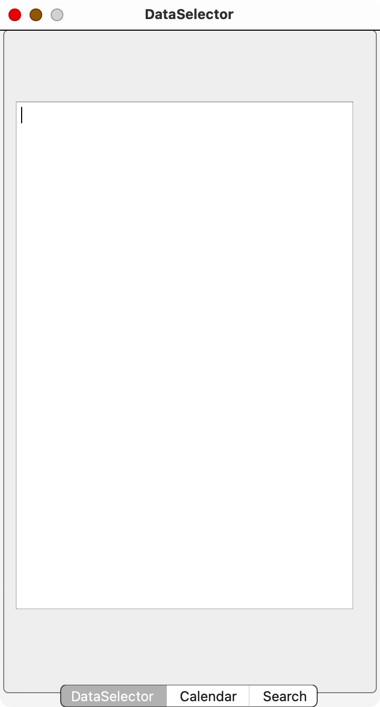
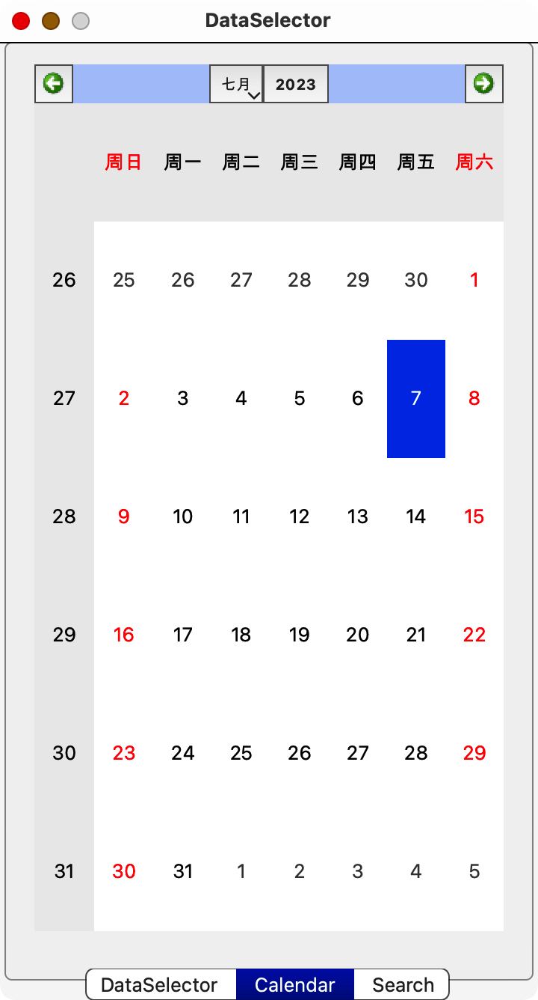
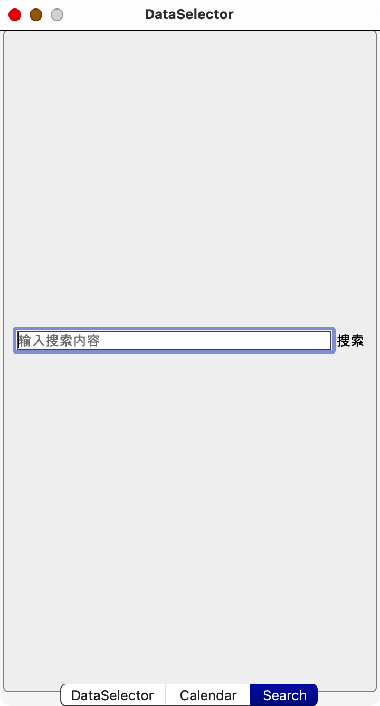

# 中期答辩 ppt

### 大纲

1. 项目进展情况
   A. 项目概述
   B. 已完成工作
   C. 正在进行的工作

2. 问题与解决方案
   A. 遇到的问题
   B. 解决方案

3. 下一步计划
   A. 完成剩余工作
   B. 时间安排

4. 结论
   A. 总结项目进展情况
   B. 展望项目后续发展

### 项目进展的情况

#### 项目概述

本次项目通过对 “文本挖掘”的研究，利用相关算法将学院以大段文本形式呈现、信息糅合一体的通知抽象成一个个简单标签，然后根据使用者的身份定位，将简化后的通知信息标签与使用者一一对应。此外还需要研究如何编写 App 前端，以及如何汇聚多个 App（例如飞书、微信、QQ）中所有通知群的信息到我们开发的 App 中。

1. 实践文本分类和文本摘要技术，提高文本处理效率和准确性。
2. 学习前端技术，实现简单的界面和交互效果。
3. 掌握项目部署技能，将项目上线并运行。

#### 已完成工作

已经基本完成基础阶段的学习

我们已经掌握了 Linux（arch）环境，并能够编写一些简单的 Shell 脚本。此外，我们还能够使用一些命令行工具，如 Docker 等，来完成一些简单的项目部署。

此外我们也学会了如何利用 pytorch 搭建神经网络，以及面向 API 文档编程。

我们已经学习了一些 NLP 算法如 RNN、LSTM、transformer 等，以及基于 transformer 的一些模型如 BERT、GPT 等，并了解了一些基本原理。

已经开发了一个简陋的用 Qt / C++编写的前端。

在这里，我们也为您提供了一些接口，即信号与槽。这些接口可以帮助您更好地控制程序的运行。

#### 正在进行的工作

我们小组正在进行 hugging_face 官网上的经典的文本摘要项目练习，使用的是 T5 模型。此外，还在系统地学习中，参考了李沐先生的《动手学深度学习》等书籍。

### 问题与解决方案

#### 遇到的问题

1. 文本分类数据集的搜集问题一直是自然语言处理领域的一个难点。在进行通知分类时，我们发现很多开源模型更倾向于对新闻进行泛化分类，而没有更细致的主题分类。在 Hugging Face 的官网上也没有此类的数据集可供使用，因此我们需要自制一些数据集来满足我们的需求。

2. 由于预训练模型的存在，我们这次自制的数据集样本量应该不会很大。
3. 但是，NLP 项目依赖于庞大的算力，这也是我们在进行项目时需要考虑的一个重要因素。如果没有足够的计算资源，我们将无法完成高质量的文本分类任务。

#### 解决方案

1. 迁移学习是完成文本分类任务的有效技术，我们需要掌握它。
2. 爬虫技术对于制作数据集至关重要，需要尽快学习并掌握。
3. chatGPT可以为数据打上标记，减少手动标记的工作量。
4. NLP项目需要大量算力支持，但目前缺乏立项资金，只能在本地跑少量数据，等到有条件时再使用运算服务器进行训练。

### 下一步计划

#### 结题预期目标

- 实现基于 flask 的 web 前端
- 实现文本分类的任务
- 实现将消息的摘要在对应日期的日历里添加提醒

#### 时间安排

1. 我们计划在暑期期间完成后端的开发工作，以确保系统的稳定性和可靠性。
2. 预计在10月份前完成前端的开发，以确保用户体验和界面设计的完美呈现。

### 结论

#### 总结项目进展情况

1. 项目进度滞后可能会影响整个计划的实施，需要及时采取措施加快进度。
2. 我们需要仔细分析原因，制定相应的解决方案，确保项目能够按时完成。
3. 我们也需要与学长老师进行沟通，共同推进项目进程。

#### 展望项目后续发展

本项目的目标是为学院通知发布工作提供服务，实现以下五项功能：精准分类、要点捕捉与简化、重要通知收藏与推荐、日程安排表个性化生成。我们将致力于让学校通知更加高效、便捷地传达给广大师生，提高沟通效率和信息传递的准确性。
